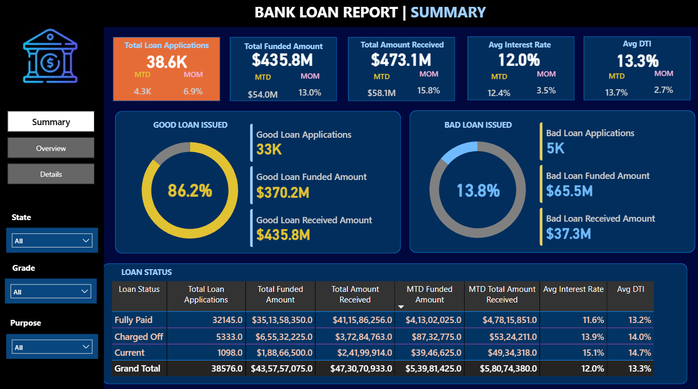
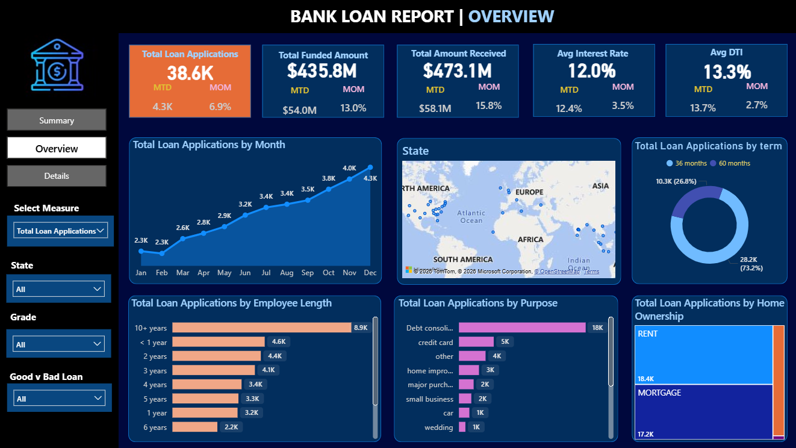
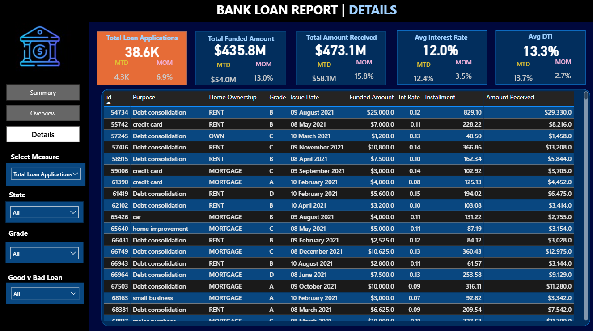

## 📊 Dataset

- **Total Records:** 38,576 loan applications
- **Columns:** 24 features
- **Domain:** Banking & Finance

---

## 🔍 Key Insights

| Metric | Value |
|--------|-------|
| Total Applications | 38.6K |
| Total Funded Amount | $435.8M |
| Total Amount Received | $473.1M |
| Avg Interest Rate | 12.0% |
| Good Loan % | 86.2% |
| Bad Loan % | 13.8% |

---

## 🐍 Python — Data Cleaning

- Handled null values and duplicates
- Fixed date formats and data types
- Exported 8 cleaned CSV files for Power BI

---

## 🗄️ SQL Queries Covered

- Total Applications (MTD, PMTD)
- Good Loan vs Bad Loan analysis
- Monthly, State, Purpose, Term wise analysis

---

## 📋 Power BI Dashboard — 3 Pages

1. **Summary** — KPI cards, Good/Bad loan charts
2. **Overview** — Monthly trends, State map
3. **Details** — Row-level data with filters

---

## 📸 Dashboard Preview

### 📋 Summary

### 📊 Overview

### 📑 Details

                  

----

# 📬 Connect with Me
- 💼 LinkedIn: [Sai Keerthana Yarraguntla](https://www.linkedin.com/in/sai-keerthana-yarraguntla)
- 📧 Email: saikeerthanayarraguntla@gmail.com
